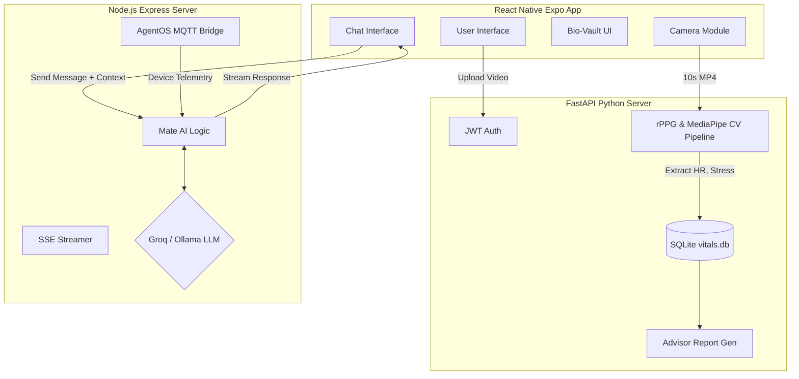
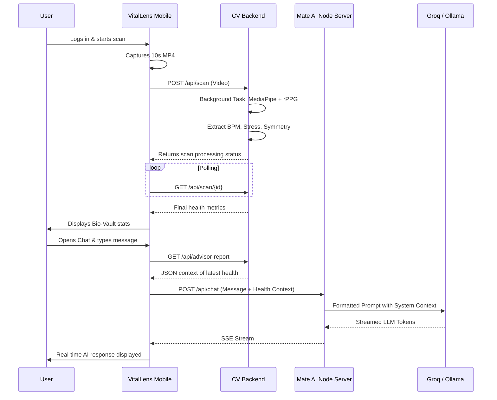

# VitalLens & Mate AI Integration


<div align="center">
  
  <h3>The intelligent, real-time health and wellness oracle combining computer vision bio-scanning with conversational AI.</h3>
  
  [](#)
  [](#)
  [](#)
  [](#)
  [](#)
  [](#)
  [](#)
</div>

---

## 📖 Table of Contents
- [Executive Summary](#executive-summary)
- [System Architecture & Block Diagrams](#system-architecture--block-diagrams)
- [Technology Stack](#technology-stack)
- [Workflow Orchestration & Data Flow](#workflow-orchestration--data-flow)
- [Extracted Bio-Metrics](#extracted-bio-metrics)
- [Project Directory Structure](#project-directory-structure)
- [Deployment & Quick Start](#deployment--quick-start)
- [Milestones & Modifications](#milestones--modifications)

---

## 🚀 Executive Summary

**VitalLens** is an advanced mobile health application that leverages standard smartphone cameras to perform remote health monitoring. In just 10 seconds of facial scanning, the system extracts critical biometrics using remote photoplethysmography (rPPG) and facial landmark tracking (MediaPipe).

This biometric data is then instantly and seamlessly passed to **Mate AI**, our integrated conversational agent (powered by Groq/Ollama LLMs). Mate AI utilizes this hyper-personalized biological context to offer tailored wellness protocols, longevity forecasts, and actionable health insights in real time.

---

## 🏗 System Architecture & Block Diagrams

The project is structured across three core layers: the Edge/Mobile Tier, the Computer Vision/API Tier, and the AI/LLM Tier.

### High-Level Block Diagram



### Component Breakdown

1. **VitalLens Mobile App (Frontend):** React Native (Expo) app handling user authentication, video capture (via `expo-camera`), displaying health metrics (VaultScreen), and real-time chat with the AI.
2. **VitalLens AI Backend (FastAPI):** Python 3.10 server using OpenCV, MediaPipe, and SciPy to perform complex signal processing on video feeds to calculate Heart Rate, Stress Index, Symmetry, and Radiance.
3. **Mate AI Server (Backend/Web):** Node.js server connecting to the Groq API (Llama 3) for inference. It also hosts a web interface with Three.js particle effects and an AgentOS bridge for IoT device integration via MQTT.

---
##SCREENSHOTS 


## 🛠 Technology Stack

### Mobile Application (React Native)
- **Framework:** React Native managed via **Expo**
- **Routing:** React Navigation (Stack & Bottom Tabs)
- **Hardware Integration:** `expo-camera`
- **Data Persistence:** `expo-secure-store`
- **Styling:** Custom dynamic dark theme

### Analysis Backend (FastAPI)
- **Core:** Python 3.10, FastAPI, Uvicorn
- **Computer Vision:** OpenCV (`cv2`), MediaPipe Face Mesh (468 landmarks)
- **Signal Processing:** NumPy, SciPy (Bandpass filtering 0.7-4.0 Hz, FFT)
- **Database:** SQLite (`vitals.db`) via SQLAlchemy ORM
- **Security:** JWT Authentication (`python-jose`, `passlib`)

### AI Server (Node.js)
- **Core:** Node.js, Express.js
- **LLM Integration:** Groq API (`llama-3.3-70b-versatile`), local Ollama fallback
- **Real-Time Communication:** Server-Sent Events (SSE)
- **IoT Integration:** MQTT (`mqtt` package)
- **Database:** `nedb` for lightweight chat history
- **Frontend (Web):** Vanilla HTML5/CSS/JS, Three.js (Particle Swarm), Marked.js, PWA support

---

## 🔄 Workflow Orchestration & Data Flow

### The User Journey



---

## 🧬 Extracted Bio-Metrics

The computer vision pipeline processes the RGB trace of specific facial regions (cheeks, forehead) using the **rPPG** pipeline to extract:

1. **Heart Rate (BPM):** Extracted by detecting micro-color changes in the skin caused by blood flow, passed through an FFT to find the dominant frequency.
2. **Stress Index:** Derived from Heart Rate Variability (HRV) proxies.
3. **Symmetry Score (0-100%):** Evaluates facial muscle balance and posture using MediaPipe landmarks.
4. **Radiance Score (0-100%):** Analyzes skin texture, color uniformity, and micro-hydration levels.

*(Note: The system contains a robust fallback mechanism that generates mock plausible vitality data if face detection fails on Android emulators or low-quality webcams, ensuring development is never blocked).*

---

## 📂 Project Directory Structure

```text
f:\venv-vitallens\
├── Include\mate_AI\mate_AI\
│   ├── agentos-bridge/       # MQTT-to-HTTP bridge for STM32 edge devices
│   ├── data/                 # Chat histories and user profiles (nedb)
│   ├── docs/                 # API and architecture documentation
│   ├── ml/                   # Extended ML pipelines (stress models, face analysis)
│   ├── public/               # PWA Web frontend for Mate AI (Three.js, glassmorphism UI)
│   ├── scripts/              # Deployment and utility scripts
│   ├── training_data/        # Health Q&A pairs and wellness protocols for fine-tuning
│   ├── uploads/              # Temporary storage for video processing
│   ├── vitallens-app/        # Core VitalLens applications
│   │   ├── backend/          # FastAPI Python Server (rPPG, Database, Auth)
│   │   └── mobile/           # React Native Expo App (vitallens-mobile)
│   ├── server.js             # Massive Node.js Express server for Mate AI (Port 3000)
│   └── package.json          # Node dependencies
├── *.bat                     # Orchestration batch scripts (start_all, hard_reset, etc.)
└── README.md                 # This file
```

---

## 🚀 Deployment & Quick Start

The project relies on running multiple interconnected microservices locally on development environments (Windows/CMD).

### 1. Unified Launch (Recommended)
Run the master batch script located in the root directory to spawn all services:
```cmd
cd f:\venv-vitallens\
start_all.bat
```
*(This triggers `start_backend.bat`, `start_mate_ai.bat`, and `start_mobile.bat` in separate console windows).*

### 2. Manual Launch Instructions

**VitalLens Backend (FastAPI - Port 8000)**
```bash
cd f:\venv-vitallens\Include\mate_AI\mate_AI\vitallens-app\backend
uvicorn app.main:app --host 0.0.0.0 --port 8000
```

**Mate AI Server (Node.js - Port 3000)**
```bash
cd f:\venv-vitallens\Include\mate_AI\mate_AI
node server.js
```

**VitalLens Mobile (Expo/React Native)**
```bash
cd f:\venv-vitallens\Include\mate_AI\mate_AI\vitallens-app\mobile\vitallens-mobile
npx expo start
```
*Note for Emulators: Ensure `API_IP` in `src/api.js` is set to `10.0.2.2` if running on an Android Virtual Device.*

### Utility Scripts
- `start_mobile_clear_cache.bat`: Starts Expo with a cleared Metro bundler cache.
- `hard_reset_mobile.bat`: Performs a deep clean (deletes `.expo` and `node_modules\.cache`), useful for resolving native build state corruption.

---

## 🛠 Milestones & Modifications

Since Day 1, the architecture has evolved significantly:

1. **Monolithic to Microservices:** The original AI chat logic and CV processing were tightly coupled. They were split into the FastAPI CV Backend (for heavy numeric processing) and the Node.js Express Server (for async LLM streaming).
2. **Context Injection:** Engineered a client-side context injection pattern where the mobile app fetches the latest `/api/advisor-report` from Python and transparently passes it to the Node.js server during a chat prompt, avoiding complex shared database architecture.
3. **Async Video Processing:** Moved MediaPipe frame analysis into FastAPI `BackgroundTasks`. The mobile app now uploads the video, immediately receives a `scan_id`, and polls the server. This resolved previous HTTP timeout errors on slower hardware.
4. **AgentOS IoT Bridging:** Added an MQTT bridging layer (`agentos-bridge/`) to ingest real-world telemetry from STM32F4-class microcontrollers, paving the way for multi-modal health monitoring (e.g., room air quality + user biometrics).
5. **Emulator Resilience:** Built-in computer vision mock failovers to allow continuous frontend development even when webcam pass-through to the Android Emulator fails to capture a real face.

---
*Generated & maintained with care.*
